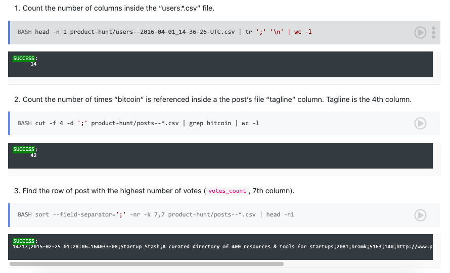
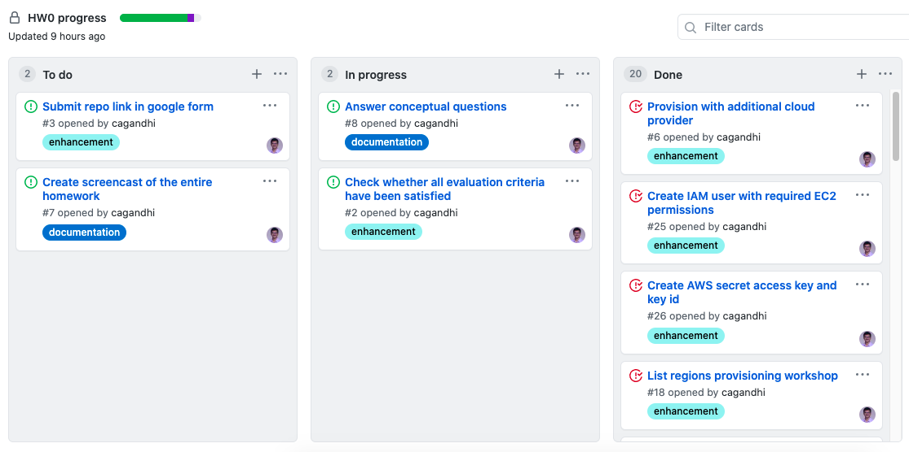

# HW0-DevOps
**Name:** Chintan Gandhi  
**Unity ID:** cagandhi  
**Student ID:** 200315238

## Table of Contents
- [Do class activities](#do-class-activities)
- [Do Basics workshop exercises](#do-basics-workshop-exercises)
- [Opunit checks](#opunit-checks)
- [Answer Conceptual questions](#answer-conceptual-questions)
- [Complete provisioning workshop](#complete-provisioning-workshop)
- [Provision with additional cloud provider](#provision-with-additional-cloud-provider)
- [Screencast](#screencast)
- [Bonus: Git](#bonus-git)

## Do class activities

* [x] Make a brief introduction of yourself in #welcome

* [x] Pick and explain the difference between nightly builds, continuous integration, continuous delivery, and continuous deployment in Breakout.
* [x] Discussion: Living with Continuous Deployment.  

I joined the breakout session in the channel us-east-1 in the 2 pm slot. We discussed the differences between nightly builds v/s Continuous integration and Continuous deployment v/s continuous delivery.  

Nightly builds are the builds generated at night time where a lot of tests, long running as well can be run. Continuous integration means that you run unit tests, static analysis checks and other measures at the push of every commit itself so that you know that the developed code actually works.  

In continuous delivery, we go one step further and automate all other tests such as regression tests, acceptance tests, etc. and make the build ready for production. The deployment to production is manual whereas this step is automated in continuous deployment.  

Fast to deploy, slow to release methodology means you prepare your pipeline in such a way that your deployments can be made ready quickly. However, you may not want the users to gain acccess to all features just yet so you hold off on deploying the changes to production and slowly release them for stable and smooth customer experience.  

If every change in code can be used by customer, this means that the code we write would need to be robust so that customer does not face any issues. Other members described their experiences with shipping code to production.

## Do Basics workshop exercises

* [x] Setup: Practice: Installing useful software

* [x] Setup: Exercise: Customize your bash prompt

* [x] Shells: Exercise: Data Science with Bash

   1. `head -n 1 product-hunt/users--2016-04-01_14-36-26-UTC.csv | tr ';' '\n' | wc -l`
   2. `cut -f 4 -d ';' product-hunt/posts--*.csv | grep bitcoin | wc -l`
   3. `sort --field-separator=';' -nr -k 7,7 product-hunt/posts--*.csv | head -n1`

   

* [x] Markdown: Practice: Create an About Me Page (AboutMe.md) in your homework submission.

[AboutMe.md](AboutMe.md)

* [x] Online Tools: Practice: Set up a Task List and Github Project(create issue and project board in your repository for this homework.)

[Project Board](https://github.ncsu.edu/cagandhi/HW0-DevOps/projects/2)

## Opunit checks

## Answer Conceptual questions
1. **Explain class philosophy of "Understand how it works".**  
Companies build their own tools. They don't use off-the-shelf products for their purposes. Hence, it is worthwhile to cover the underlying technology and concepts that relate to tools rather than learning about tools themselves many of which might become obsolete in a couple of years.

2. **What is heredoc, and why might it be useful?**  
heredoc is a special purpose code block which is used to feed values to variables or can also be used as input list to interactive commands. 
  
It might be useful for a couple of reasons: 
   1. It allows us to define content directly rather than storing the content in a temporary file and then redirecting it as input. 
   2. When heredoc is used to store values of variables, we don't need to escape quotes which might be considered a cleaner and visually appealing way to write code.

3. **Explain what does it mean by "Commits are NOT diffs"?**  
Git commit model is based on snapshots. This means that on every commit, Git records the contents of each file in the repo and not just the differences in the files. This means that when we checkout a commit, Git can simply pull the snapshot which is much faster than building the file contents by aggregating the diffs since the first commit.

4. **What are signs of a bad kanban board?**  
   * Ill formed user stories. If upon reading user stories, it isn't clear who/what is going to benefit upon its completion of this story or why the story is being done, then it means that there is no value in the work being done or the value isn't clear to the team.
   * There isn't a clear flow on how the task cards move on the board. If a card directly moves from backlog to in progress column, it signals bad prioritization on the team's part.
   * The operation time for a task is either too small or too large. If a task can be completed too quickly or stretches for too long, it means the team has improperly planned the flow and review is needed.

5. **Why are nightly builds useful?**  
   * They allow the developers to ensure that changes made in the previous day didn't break the product functioning as a whole. This means that every day there is a version of product which builds and runs correctly and can be used further in the deployment pipeline. 
   * When code analysis checks or certain tests take too long to run, you don't run them on every commit but run them as part of your daily build process as there is enough compute power available at the end of the day to handle long running tests.
   * For larger projects, it may be the case that the CI process does not check all the branches of the code but only the main branch. Nightly builds can step in and can ensure that all the code branches build successfully when the tests are run at night.

6. **Explain "Every Feature is an Experiment"**  
With continuous deployment practice in action at companies, developers treat every feature as an experiment. No feature's place in the software is set in stone and whether it continues to live on in the software is decided by software metrics and user interactions that are recorded and stored. As a result, a feature which is not used by the users or is detrimental to the performance of the software as a whole is usually scrapped. This methodology is in stark contrast to the earlier notion of developing fixed set of features that are carefully chosen and evidence was lacking as to whether these features were actually useful in the software.

7. **What does it mean by "Comfort the Customer with Discomfort"**  
In this age of continuous deployment, companies are focusing on delivery software with a constant stream of updates. However, continuously changing software might pose a problem for enterprise users since the updates might not sit well with their internal ecosystem. Hence, companies are increasingly trying to comfort the customers by providing simple update procedures or involving users directly in unit and integration testing phases so that the discomfort can be mitigated to a large extent.

8. **Explain "You are the Support Person"**  
At larger companies, the culture is usually that whoever builds something is the one responsible to provide any support related to the code change as well. This primarily means that there are no separate QA or tester roles who simply look to test and make sure that the code is working. It is the responsibility of the code developer to make sure that the code works. If anything breaks in regards to the code change, it is upon the code developers to look into the issue and debug it.

9. **Why can sharing an api key be problematic?**  
   * An API key can provide access to secure resources. If the API key is shared, people can access these resources on your behalf which may pose a security threat. Others' acts can effectively lead to a problem for the original API key holder as well. For example, if I share my DigitalOcean API key, people can use the key to manage my DO virtual machines or other resources without my knowledge.
   * A free API key often has rate limitations. If such an API key is shared, people may use it for their purposes depleting your limit and ultimately resulting in a situation where you yourself are unable to access because your API key has reached its designated limit.
   * For a paid API key, sharing your API key may result in unnecessary expenses incurred on your end. 
10. **What differences did you observe between the two cloud provider apis you tried?**  
* DigitalOcean API, in my opinion, was much more friendly and easy to use as it used simple HTTP requests and JSON response to communicate data. The AWS EC2 API that I used felt extremely bloated and complicated with documentation scattered everywhere that made it a bit difficult to piece everything together and get the code working. 
* Fetching the API token on DigitalOcean was a single straightforward step. On the other hand, there were comparatively more steps on the AWS as I had to create a separate user with the appropriate permissions and then store the secret access key and access id.
* AWS is more restrictive as it allows us to set permissions via policies on the user so that only required information can be fetched via the access key and id pair whereas I didn't find such functionality in the DigitalOcean token. It seems any API token that I create allows me administrator access. 

## Complete provisioning workshop
Take a look at this [readme](workshop_cloud_provision/README.md) file.

## Provision with additional cloud provider
I have used AWS as the additional cloud provider. Take a look at this [readme](aws_additional_provision/README.md) file.

## Screencast
* [Opunit profile check screencast](https://drive.google.com/file/d/1jofQ8HkfZ531e-Xn0YwAC9urh08HGvh_/view?usp=sharing)
* [Cloud Provisioning workshop - DigitalOcean screencast](https://drive.google.com/file/d/1r3SzmOFHAwiUEPpY0yaexIsCiCShkL56/view?usp=sharing)
* [Additional Cloud Provider - AWS screencast](https://drive.google.com/file/d/1G7WCB0jAmasCrwB5pREF4LyPj5IsbiQi/view?usp=sharing)

## Bonus Git

