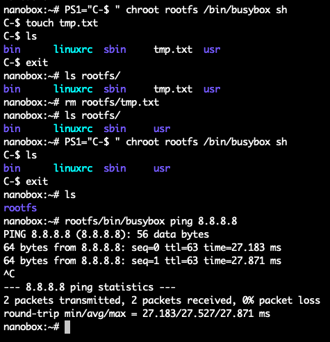
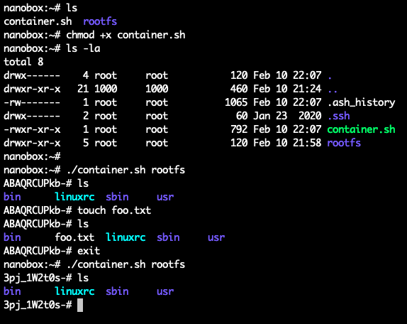
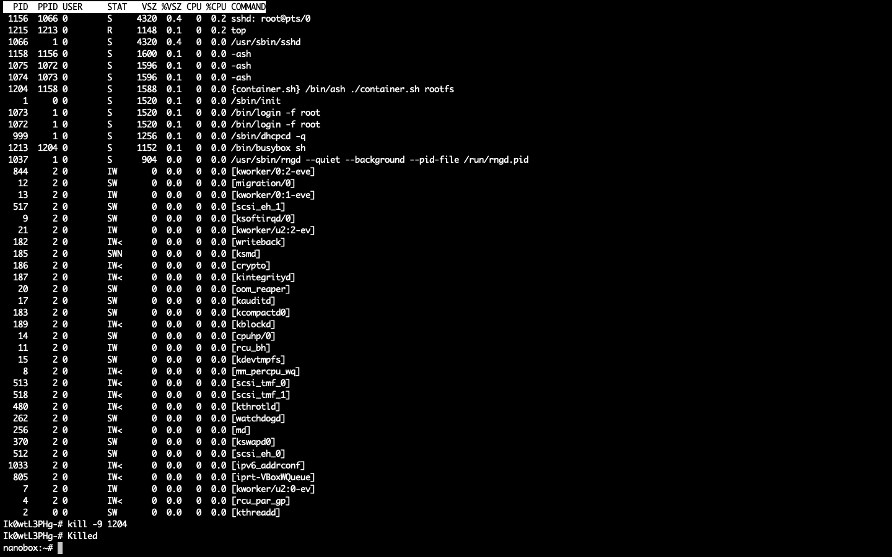
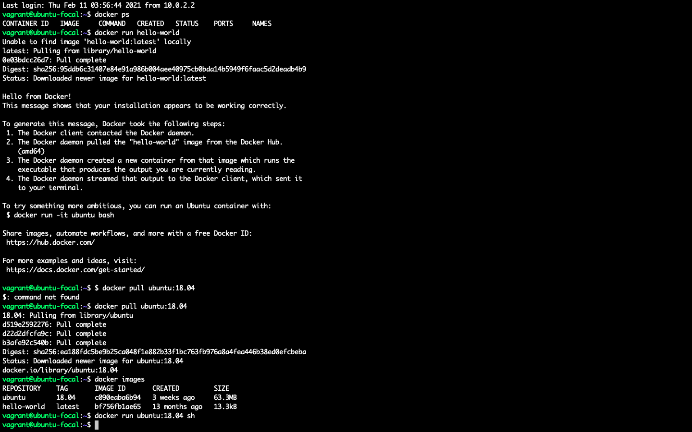
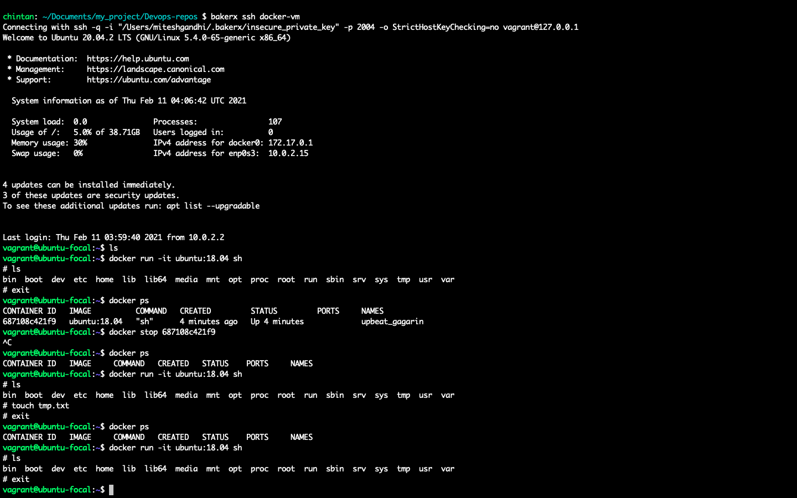
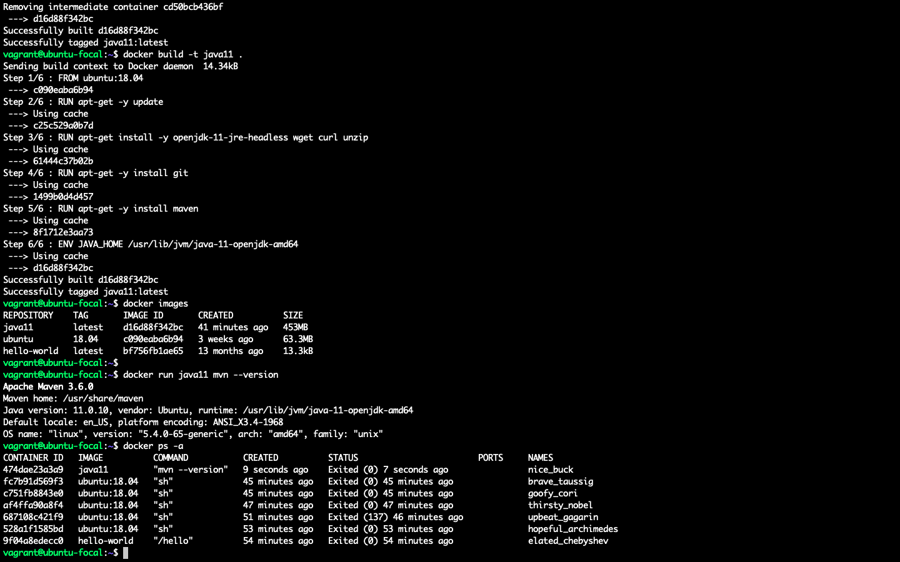
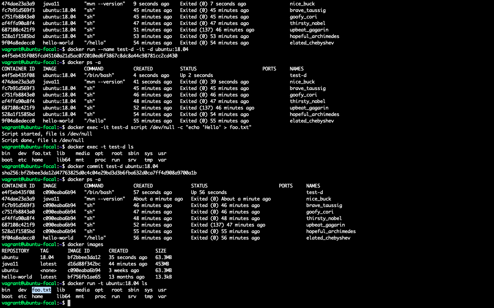
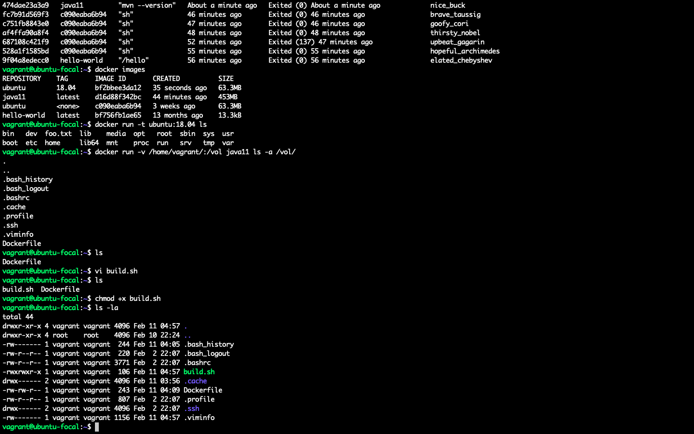
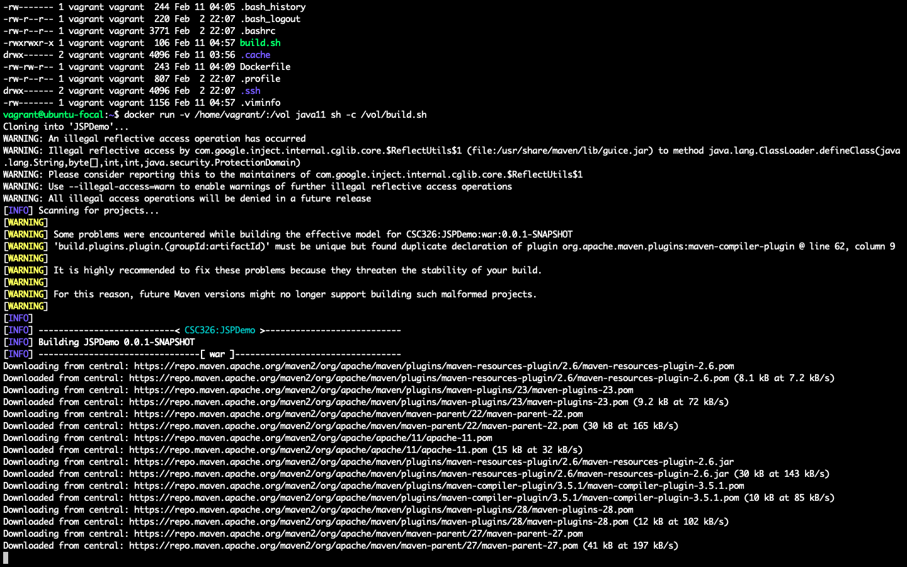
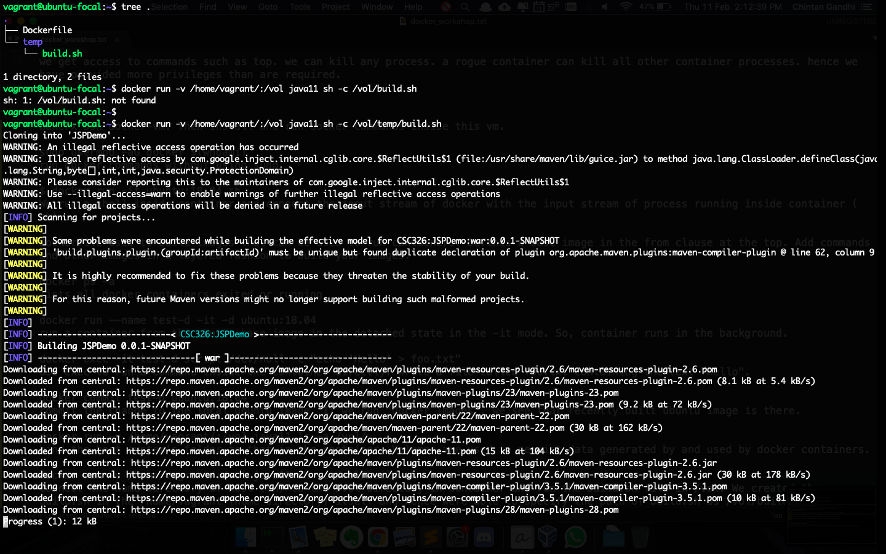

# Docker Workshop

## Prepare a simple rootfs with busybox
* We downloaded the busybox executable and created symlinks for shell commands inside the `rootfs/` directory. 
* When we invoked a new shell using busybox executable, created a temp text file and then removed it from the VM (host) file system. Invoked another shell using busybox executable and the file isn't there which means that the container and the VM (host) share their file systems. This does not fulfill isolation property.



## Introducing overlay filesystem

### Before mounting /proc

* Created a file `container.sh`. This file contains commands to create a overlay file system where we split the read only portion of the file system and the change state file system. 
* Instantiated a new container by executing this file and then created a new text file inside it. When we exited and created another container, we are not able to see the text file we created before.
* This means we have isolated the file system and whenever we instantiate a new container, we start with a new copy of the host file system.



### Mount /proc directory

* We get access to process-related commands such as top. We are able to manipulate processes such as kill the container that we are in itself. This may allow a rogue container to create havoc in the system by killing other container processes. Hence we have provided more privileges than are required.



* In the last 2 commands, we kill the process identified by `PID = 1204`. This is the container process we were in. As we can see, we simply exit out of the container into the VM (host) system.

## Introducing Docker containers

### Setup and Playing with Docker
* We create a new Linux VM and after SSHing into it, install docker and run the commands inside this VM. 
* For us, the host system is the VM itself since Docker uses capabilities of the Linux kernel, such as cgroups and namespaces to improve upon the drawbacks of our home-grown containers.

```bash
$ sudo usermod -aG docker $(whoami)
```
Run docker commands without using `sudo`.



```bash
$ docker run -it ubuntu:18.04 sh
```
We run the shell process inside the container and connect the input stream of docker with the input stream of process running inside container (`sh`).



### Building Images
`Dockerfile` is used to build images that can be used to invoke containers. We Define a base image in the `from` clause at the top. We add commands and other images in a layered fashion to build the images.

```bash
docker build -t java11 .
```
We build a docker image named `java11` from the Dockerfile in the specified path `. (current directory)`.

```bash
docker ps -a 
```
List all docker container processes.



```bash
docker run --name test-d -it -d ubuntu:18.04
```
Run a container from the `ubuntu base image` and tag it as `18:04` in the detached state in the `-it` mode. Detached state means the container process runs in the background.

```bash
docker exec -it test-d script /dev/null -c "echo 'Hello' > foo.txt"
```
Use `exec` to run a command inside the container directly. Create a file called `foo.txt` containing the text `Hello`.

```bash
docker commit test-d ubuntu:18.04
```
Commit the change we made in the `test-d` container to the local `ubuntu` image. If we run `docker images`, we see that recently built ubuntu image is there.



```bash
docker run -v /home/vagrant/:/vol java11 ls -a /vol/
```
Bind the host system's home directory `/home/vagrant` to the `/vol` folder in the container. Volumes are used to persist data generated by and used by docker containers.

We create a `build.sh` file which contains commands where we clone a Java application repo and compile it using `maven`.



```bash
docker run -v /home/vagrant/:/vol java11 sh -c /vol/build.sh
```
Connect the home directory of host (VM) to the `/vol` directory in container and run the `build.sh` file present in the `/vol` directory of the container. We created the `build.sh` in the `/home/vagrant` (home directory) itself and hence were able to run the build file by specifying the path as `/vol/build.sh`.



```bash
mkdir temp/
mv build.sh temp/
docker run -v /home/vagrant/:/vol java11 sh -c /vol/build.sh
```
We get an error that the `/vol/build.sh` cannot be found. This is because we moved the `build.sh` inside the temp folder in `/home/vagrant`. We mount the `/home/vagrant` as /vol in the container. If we now want to execute the build file, we need to specify its path as `/vol/temp/build.sh`.

```bash
docker run -v /home/vagrant/:/vol java11 sh -c /vol/temp/build.sh
```
When we specify the proper path of the `build.sh` file, it gets executed.


