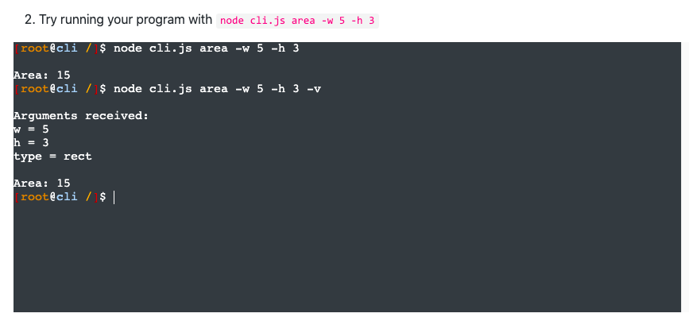
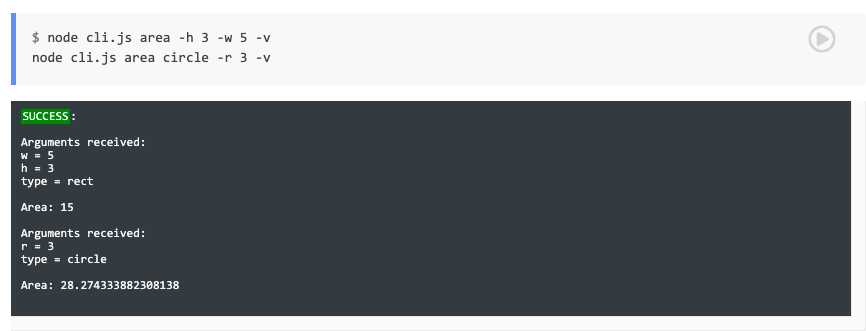

# HW1
**Name:** Chintan Gandhi <br>
**Unity ID:** cagandhi <br>
**Student ID:** 200315238

## Class activities

* [x] Discussion: Describe a situation where it was difficult to run code from someone else <br>
I joined the breakout session `nyc3` in `8 pm` slot on `Feb 2`. We discussed about common issues faced when working on someone else's code. The common issues discussed were unclear instructions to setup the codebase, OS specific commands or utilities which does not port for other OSes, improper definition of dependencies, etc.

* [x] Complete "On your own": Ubuntu up script <br>
Take a look at [up-ubuntu.sh](scripts/up-ubuntu.sh).
* [x] Complete the [CLI notebook](https://docable.cloud/chrisparnin/notebooks/nodejs/CLI/cli.md) <br>
Here is the modified [cli.js](scripts/cli.js) file. <br><br>
The output screenshots are attached below: <br>


* [x] Complete "Docker workshop" <br>
Here's the [Docker workshop Readme](Docker_Workshop.md).

## Answer the following conceptual questions

* Why can code be difficult to run on another machine?
   - Other machine may have a different operating system which might have a different file structure as well as a different package manager to install stuff.
   - Poorly defined dependencies or installation of incorrect versions of packages
   - Different setup of the coding environment
* Explain the concepts of a computing environment and headless infrastructure.
   - Computing environment is a collection of configuration and codebase. Configuration consists of setting up an environment on a different machine and so that the codebase can be properly executed.
   - Headless infrastructure consists of lightweight infrastructure that can be provisioned in such a way that it can be spun up quickly and can be discarded upon completion of the task.
* Compare full emulation virtualization vs. binary translation
   - Full emulation virtualization is a technique where the virtual machine can be thought of as running a user application with some code is written to emulate the functioning of CPU, memory, network drivers, etc. in order to accomplish the task. 
   - Binary translation consists of the virtualization technique where the guest OS in the VM is not modified but rather unsafe instructions in the code block are replaced by safe instructions which emulate the desired behavior and then the code is run.
   - Full emulation virtualization emulates all hardware resources whereas in binary translation, only unsafe instructions are modified and emulated and the rest can be run at hardware speeds.
* What are some use cases associated with microvms and unikernels? 
   - Embedded applications such as Windows Subsystem for Linux where only the required OS functionality is virtualised to run the application.
   - Serverless architecture such as AWS Lambda where just the required kernel stuff + code is packed into a unikernel so the code can be run with a low memory footprint.
   - FPGAs for optimized machine learning where the hardware and software need to be minimal and tightly integrated for faster inference.
* In VM workshop, why can't the `eth0` ip address be pinged from the host?
   - The VM is in the NAT networking mode and is in a private network internal to the VirtualBox software. `eth0` ip address is in a different private subnet than the host IP address and hence is unreachable from the host and consequently can't be pinged from the host.
* How can bakerx access the virtual machine through ssh?
   - bakerx uses the `ssh -i` command to access the VM machine by passing an identity file which allows proper authentication. This identity file is stored in the `~/.bakerx` directory by the name of `insecure_private_key`. Using the identity file for authentication, providing port set up for the SSH before and the username and host IP for the VM, bakerx allows us to connect to the VM.
* What are the limitations of using `chroot` for os-virtualization?
   - No CPU/memory limits can be imposed on the processes
   - Other processes can still be visible from one of our so-called containers. We saw this in the workshop when we were able to see all the processes running and kill the container process itself when we mounted the `/proc` itself.
   - We can't use the same network port as an entrypoint for another process.
   - Abundant security issues. `chroot` does not separate processes into groups and hence the security concerns arise.
* Why is the builder pattern useful for building images?
   - Allows us to build our images in layers and reuse already created images and add our functionality on top of it.
   - Allows us to throw away old layer and just keep the bottom layer on which we just have the binary file we want. This helps in reducing the unnecessary memory footprint of the old layer and hence results in a overall lesser size of the docker image.
## Virtual Machine provisioning with CLI program

### VM setup
1. Add a NIC with NAT networking.
2. Add a port forward from 2800 => 22 for guestssh.
3. Add a port forward from 9000 => 5001 for a node application.

Here's the [code snippet](commands/up.js#L113-L126).
```js
// 1
await VBoxManage.execute("modifyvm", `${name} --nic1 nat`).catch(e => e);
// 2
await VBoxManage.execute("modifyvm", `${name} --natpf1 guestssh,tcp,,2800,,22`);
// 3
await VBoxManage.execute("modifyvm", `${name} --natpf1 nodeport,tcp,,9000,,5001`);
```

### Post-Configuration
1. Install nodejs, npm, git
2. Clone https://github.com/CSC-DevOps/App
3. Install the npm packages

Here's the [code snippet](commands/up.js#L233-L254).
```js
// 1
await ssh("sudo apt-get -y update");
await ssh("sudo apt-get -y install nodejs npm");
await ssh("sudo apt-get -y install git");
// 2
await ssh("git clone https://github.com/CSC-DevOps/App");
// 3
await ssh("'cd App/ && npm install'");
```

### SSH and App
* Implement and demonstrate running `v ssh`.
* Manually run `node main.js start 5001`.
* Demonstrate you can visit `localhost:9000` to see your running App.

Here's the [ssh.js](commands/ssh.js) file.

### Extra Requirements
1. Create a second NIC with host-only networking enabled and set the IP address to 192.168.33.10. Demonstrate that you can use your IP address to visit [http://192.168.33.10:5001/](http://192.168.33.10:5001/) to see your running App.

> Usage: `v up -f --er1`

The function [`extraReq1AddAdapter(name, static_ip)`](commands/up.js#L128-L212) creates a virtual network adapter with the proper gateway ip if it does not exist or fetches the name of the existing network adapter. It then adds the host-only NIC to the VM by providing the name of the network adapter as an argument.

The function [`extraReq1AddIP(static_ip)`](commands/up.js#L214-L231) adds a new ethernet network interface inside VM with the static IP provided along with setting the gateway. This makes the host OS communicate with the VM via the static IP assigned.

## Screencast
Screencast Link: [Drive link](https://drive.google.com/file/d/1OKu2omC_Qgrbt0Cnd1wUCrEmVKHQkFe9/view?usp=sharing)
