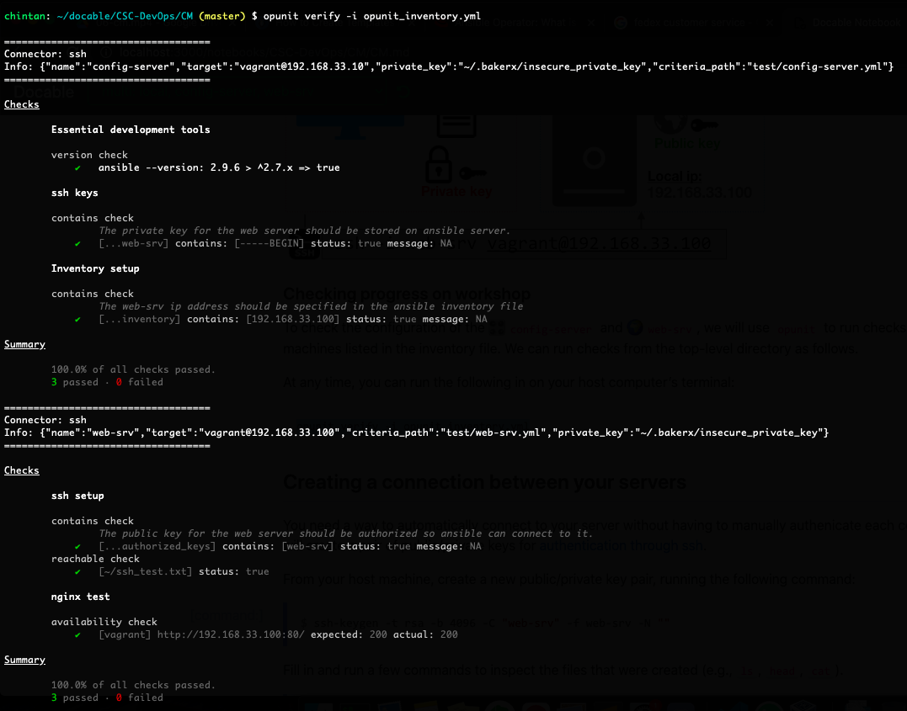

# HW2
**Name:** Chintan Gandhi  
**Unity ID:** cagandhi  
**Student ID:** 200315238

## Table of Contents
+ [Class discussion](#class-discussion)
+ [Answer the following conceptual questions](#answer-the-following-conceptual-questions)
+ [Answer the following questions about the CM workshop](#answer-the-following-questions-about-the-cm-workshop)
    * [Part 3](#part-3)

## Class discussion

__Describe your discussion for defining idempotency. What examples did you use for idempotent and not idempotent operations?__

I joined the breakout session `us-east-1` in the `8 pm` slot. The definition for idempotency was discussed briefly as it was very well explained in the lecture. Essentially, idempotency can be defined in 2 different ways. The first way of thinking pertains to operations. Applying the same operation multiple times results in the same state. The second way of thinking is that a system is able to reach the desired state from its current state.

For the idempotent operations, examples used were the HTTP GET request and database read operation. As long as the page exists on the server, running the GET request to fetch that page multiple times results in the exact same page being rendered. Similar case is with the read operation in databases as reading from a database multiple times does not change the state of the database. POST HTTP request is an example of non-idempotent operation since the server state is changed at the execution of every POST request.

## Answer the following conceptual questions

__1. What are the core activities of *traditional* configuration management?__

* Identify everything related to the software and manage changes to these aspects of the software. 
* Allow variations to the software.
* Document all changes and requirements such as who approved the changes, what requirements do these changes pertain to, etc. essentially providing a complete trace of the software product build.
* Maintain quality for all variations of the software product.

__2. What are some components of modern configuration management?__

* Source control (git - branches)
* Package managers, task and build managers such as brew, apt
* Inventory (configuration scripts)
* Infrastructure update patterns
* Orchestration and configuration management tools which allow for automatic provisioning of servers
* Testing and compliance to ensure quality control

__3. How does modern tooling and software development processes change configuration management for the better?__

* Source control systems allow us to easily view the components of the software and manage changes which are recorded in the system.
* Variations to the software can be handled by enabling branches and feature flags.
* Better code review practices, automated tests and CI/CD help ensure quality of the software and allow for somewhat better traceability between the requirements and code in production.
* These processes capture the essence of configuration management better than a word document or a book of practices which is really hard to maintain and refer to.

__4. What are some reasons why dependencies might be difficult to configure for a computing environment?__

* For many packages, module name is not the same as package name which results in name mismatch and import errors. There is no solid way to map the module name and the package name which often results in errors. For example, to import the package `beautifulsoup4`, we need to `import bs4`. 
* Transitive dependency while installing dependencies. Often, a package needs to have another package installed and sometimes, these are not packages but system dependencies, OS dependencies or version constraints.

__5. Why is idempotency useful for configuration scripts?__

* Idempotency is useful for configuration scripts because we would like to run the setup process multiple times and it should always result in the same desired machine configuration so that we can use the setup machine to serve a web app, etc. 
* Also, idempotency is important so that the tasks/operations to be performed to configure the asset do not terminate partially and if the resource already exists on the asset, skip the time-consuming setup process.

__6. Explain the difference between pull and push configuration models.__

* In a push based configuration model, the configuration tool running on the configuration server pushes out the desired configuration to the assets. If there is an update to any of the dependencies or the desired config, the config tool just triggers and pushes out the updated configuration. 

* In a pull based configuration tool, all the assets have an agent running which polls the configuration server and fetches the desired configuration. As a result, when an update is made to the desired configuration on the config server, the agent on the asset will come to know about this change as it regularly polls the config server and hence the configuration is updated on the assets.

* A push based mechanism is easier to manage since we just need to push out the desired config to the servers whose IPs are known while the pull based one is more complex since we need to ensure that the agent process is running in the background as well as that it cannot be killed. 

* In a push based mechanism, there is less enforcement of desired state in the sense that if someone manually changes the configuration, it might result in a drift from the desired config since the config server has no way to find out that the asset does not have the desired state. A pull based mechanism is better at ensuring that the assets stay in sync with the desired config. If someone manually updates anything in the asset, the agent, when it polls the config server, will come to know that the desired config is not met on the asset and will rollback the changes.

__7. Compare and contrast living infrastructure from immutable infrastructure.__

* Living infrastructure is an infrastructure update pattern where any configuration changes are applied directly on the existing instance whereas immutable infrastructure refers to deploying a read-only instance and any config change leads to creation of an altogether new instance and decomissioning of the old instance.

* In the living infrastructure update pattern, we can skip the provisioning step for each update as we simply apply the changes onto the same instance whereas in immutable pattern, the provisioning step cannot be skipped as we are creating a new instance for every update. Consequently, this results in slower updates as compared to living infrastructure since the provisioning step is an overhead at every update.

* In living infrastructure, idempotent operations are essential since we want to run the config updates again and again and ensure that the config is what is desired. If we don't have idempotent operations, we may experience config drift which means our actual instance's config is different than what is in our config server. In immutable infrastructure, we might be okay if we don't have idempotent operations since we are starting with a new instance (from scratch) at every update and deleting the old instance completely.

* Living infrastructure pattern can be simpler in the sense that if we only have a handful of servers which run properly, there might be no need to go overboard. Immutable infrastructure can become more complicated since true immutability is a bit difficult as it requires more escape hatches such as writable volumes and data subscriptions so certain data files which need to be pulled in that isn't baked into the image.

__8. Explain the difference between provisioning and configuration management.__

* Provisioning is the practice of creating instances and providing the means to connect to these instances to run the software. 
* Configuration management refers to the practice of managing the configuration/state of these created instances so that all the components required to run the software are managed easily and the software can be served through that instance.

__9. What impact does configuring a server to listen on 0.0.0.0 have? Why might this be a problem?__

When we configure a server to listen on 0.0.0.0, the server is allowed connections from all possible networks and is exposed to all IP addresses. This might be a problem as a malicious user machine might connect to our server and change configuration, remove configuration files, kill applications or can wreak any sort of havoc.

__10. What is an interesting thing you learned about research in configuration management?__ 

An interesting thing that I learned about research in configuration management is how we are able to automatically infer a computing environment based on the developed code. This is interesting because if the system works properly, it saves us the hassle of setting up the environment manually which would result in lesser bugs as well as faster provisioning and setup of servers.

## Answer the following questions about the CM workshop

__1. How did you create a connection between between the configuration server and web server?__ 

We created a public/private key pair on our host machine. We sent the private key to the configuration server and the public key on the web server. The configuration server then makes a request with this insecure private key to the web server where the matching public key is present and the authentication is authorised and the connection is thus created.

__2. Did you have any problems getting this setup?__ 

I didn't face any problems in getting this setup. Running the opunit denotes all checks passed. The documentation was clearly written. 

__3. Why does the permission of the private key need to be changed?__  

The permission of the private key needs to be changed because the private key contains sensitive data that needs to be secured and should only be readable/editable by the user and not other groups. `ssh` ignores a private key file if it is readable by others. Since we `ssh` into the web server from the config server, we need to change the permissions of the private key file.

__4. If ssh can be used to execute remote commands, why not just use bash commands for CM?__  

There are several reasons not to use bash commands:
* Bash commands/scripts can be error-prone and sending commands over `ssh` also requires us to handle the quoting in the command properly or else we might be running some portion of the command on our host machine.
* Most commands are not idempotent which may result in errors. For example, moving a file operation will require we check the presence of that file beforehand which results in bigger shell scripts rather than simple bash commands. Also, some commands may run again and again rather than checking for the presence of it and saving resources.
* Also, due to network issues and random failures, we might often need to resume operation midway and such a functionality is difficult to achieve using bash commands.

__5. What are some reasons why it is useful to have a configuration server.__  

* We can centralise the server configuration. Maintaining the configuration becomes easier as well as any updates to the desired configuration needs to be made at only one place and the config changes can be reflected in the servers from a central point. 
* Configuration server takes care of maintaining the configuration of the servers by itself. Without it, it would be very tiresome for us to execute bash scripts by sshing into the servers and performing routine checks to ensure the servers follow the desired configuration.

### Part 3

__1. What is your understanding of the `yaml` format?__

`yaml` format is an alternative to the `json` format where we have a hierarchy of objects which is denoted by the double space separation. The double space separation denotes a dictionary whereas the hyphen character is used to specify members of a list.

__2. What is the difference between a *module* and *task* in ansible?__  

A `task` is an action that is to be performed such as installing nodejs on a machine. A `module` is a library of sorts which has a list of configurable options such as `apt` or `file`. A task can have multiple steps and use more than one ansible module. Per the ansible documentation, `task` is a unit of action whereas `module` is a unit of code (something that is actually executed on the remote machine).

__3. What are situations where you might use *variables* and *templates* in ansible?__  

`Variables` can be used to store values that can be used to distinguish systems on which the configuration is done. For example, we may use variables to store the home directory path in different operating systems such as macOS, Windows, Linux, etc. `Templates` can be used to store configuration parameters and the actual values can be replaced during runtime. This is useful when we need to setup web serves, databases or CI/CD servers such as Jenkins and we store the configuration details in a template which is then copied on every remote machine where the configuration is executed.

__4. What are some operators that enable idempotence in ansible tasks?__

Modules such as `stat` check if file exists or not and execute tasks. Conditionals such as `when` check if a condition is fulfilled and operators such as `state` in module `apt` check the state of a package to enable idempotence in ansible tasks.

__5. Why are roles useful for organizing ansible playbooks?__

`Roles` allow us to include in other playbooks and let us automatically load variable files, tasks, etc. based on a file structure. As our playbook increases in size and becomes more complex, we may find `roles` useful to separate information and allow for easier visibility and debugging of ansible playbooks.
