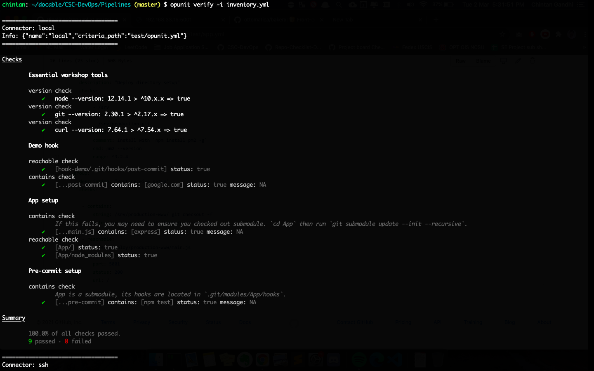
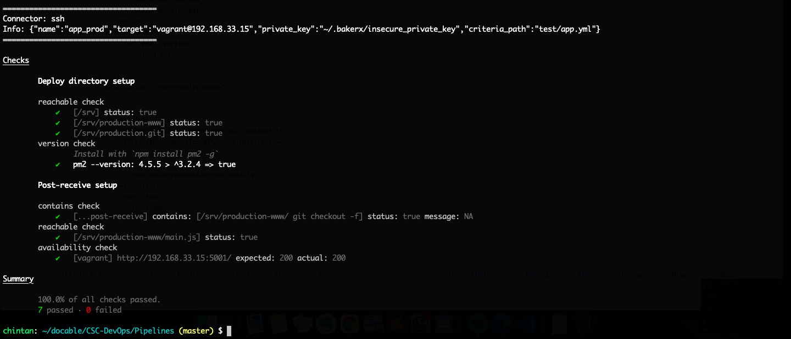

# HW3 - Pipelines

**Name:** Chintan Gandhi  
**Unity ID:** cagandhi  
**Student ID:** 200315238

### Table of Contents
- [Class discussion](#class-discussion)
- [Conceptual Questions Lecture](#conceptual-questions-lecture)
- [Completion of Pipelines Workshop](#completion-of-pipelines-workshop)

### Class discussion

Describe your discussion for continuous integration. What positive experience did you share? What was a negative experience that someone shared?

We discussed the benefits and some drawbacks of using Continuous integration in the build pipelines. 

The positive experience that I shared is my experience with using Travis for a side project of Python web app. With Travis CI, I am able to run the flake8 linting and black formatting on python code and then run unit tests and measure the test coverage and fail the build if test coverage drops below some percentage. CI benefitted me in the sense that I am more confident that if the build passes when I push a new commit, the code is usually written correctly and won't create a problem in the app working.

A negative experience shared by someone else was based on a custom CI tool that they had used during their internship. If there was some sort of build issue, it was extremely difficult to understand the issue that was causing the build to fail. They also described that if the local environment differed quite a bit from the CI server environment, then also things that ran locally would fail when run on the CI server.

### Conceptual Questions Lecture

1. Why is a pipeline useful architecture for supporting continuous deployment?

Pipeline is a useful architecture for supporting continuous deployment because the different stages in a pipeline, which usually represent a software engineering process, are triggered one after the another in a serial fashion. When fully automated, pipelines allow code changes to be automatically tested and deployed into the production within minutes. Hence, configuring a pipeline removes the manual work to certify a commit and get it into production which might take longer.

2. What is the primary principle of CI?

The primary principle of CI is to integrate the newly written correct code into the existing codebase as frequently as possible so that it is possible to release deployable software at any point in time.

3. What are some claimed benefits of CI that are supported by empirical evidence?

* Detecting defects and fixing them faster: According to one study, 75% of developers were motivated to use CI because it helped them catch errors earlier.
* Reduces assumption about environment: 70% of devs believe CI provides a common build environment thereby reducing assumptions about the environment.
* Reducing repetitive processes saves time, cost and effort: 57% of developers side in the favour of CI as it allows for faster iterations and makes the code integration easier. 
* CI can enable you to release deployable software at any point in time: 68% of developers also believe that CI helps them deploy more often thus pronouncing the claim that CI allows them to be in a position to release deployable software at any time.

4. Why can troubleshooting a CI build failure be difficult?

Troubleshooting a CI build failure can be difficult because simply looking at the log in the CI server in a somewhat random build environment without being able to get into the details of what happened exactly while running the tests or build can be frustrating and painful.

5. In the lecture, what characteristics did the four build manager tools have in commmon, how did they differ?

The four build manager tools discussed in the lecture are `npm`, `grunt`, `make` and `maven`.

The four build manager tools all provide a mechanism to manage the build lifecycle of the application by specifying the stages in the pipeline and actions to be performed for that stage.

The four tools differ in the sense that:
* `npm` uses JSON where the key is the task name and its value is the command to be run. 
* `Grunt`, on the other hand, uses JS to define tasks which execute a plugin or arbitrary JS code. npm and grunt differ from the rest as there is no enforcement in managing the lifecycle of the task. 
* `Make` uses bash commands to define tasks which have a target, the commands to be run when executing that task. `Make` takes things a step further as it allows us to specify the source, a dependency, for the target which means we are able to manage the pipeline easily as we enforce if certain tasks can happen in the absence of other tasks or not. 
* `Maven` uses XML format to do something similar to `grunt`. We define phases which are stages in build cycle and these phases contain goals which are executed by plugins.

6. Based on the reading, summarize desirable properties of the Build phase.

* **Correctness:** It is important that the build is correct. One of the bases on which the success of build depends is the definition of dependencies. If the dependencies are fully expressed, the build is theoretically correct. 
* **Velocity/Speed:** The build run should complete in a reasonable amount of time which might vary as per project. 
* **Incrementality:** Builds should execute/re-execute as required the necessary commands to update deliverables.
* **Repeatability:** Also, given the same set of inputs, builds should execute the same commands which makes them deterministic and thus repeatable. On the same lines, it should be possible to reproduce a past build in the future for verification purposes. 
* **Independence:** Builds should also be isolated from each other or else they may interfere with each other and thus this phase may become non-deterministic.

7. How might we verify a pipeline works correctly?

We verify that a pipeline works correctly by verifying that each stage of the pipeline works correctly and that a stage in the pipeline is not executed until all the previous stages have been completed successfully.

To verify the correctness of each stage of the pipeline:
* **Build:** Check that all the dependencies have been fully expressed. Perform a taint analysis. Track all the outputs of the build and see that there isn't any issue in expressing dependencies.
* **Static code analysis:** Analysis should yield a low rate of false positives since high false positive rate reduces trustworthiness of results.
* **Deploy:** Make the service accessible to public by running it on a rechable server and the service does not lead to a broken state on error.

> From Pipeline Workshop Conceptual Questions...

8. Trace the flow of a commit from the local App repository to running code in production. Can you see how it maps to the pipeline diagram?

Yes, the commit flows as shown in the pipeline diagram. When we commit in the local App repo, the `pre-commit` git hook is run which runs `npm test`. If `npm test` runs successfully, the commit is posted in the local repo. When we push the local commits to the production, we push the commit to the `production.git` directory in the remote server. What this does is trigger the `post-receive` git hook which basically checks out the master branch of the codebase and copy the content to `production-www` directory and starts the npm app via `pm2` process monitor utility. As a result, a commit made to the local repo seamlessly flows into the production app and the change can be seen instantly.

9. What are some issues that might occur if required to pass tests in a pre-commit hook?

* Running tests might take time as well as compute power and running them at every commit would sacrifice on the speed aspect. If the change in the code is not significant, running a whole test suite might decrease developer productivity. For example, in the sample App scenario, even if I just change the hello message in the file, I need to run the tests which is burdensome and probably not necessary at every commit.
* It is easy to bypass a pre-commit hook by passing the `--no-verify` flag to `git commit` command. If the tests are run in the pre-commit hook and some developer bypasses the pre-commit hook, it would mean that the developer is committing untested code in the repo which might cause problems for the codebase.
* If the organisation follows the Test-Driven Development approach, the tests would be written before the code and the approach would be red-green refactor. However, since the tests are already written and the pre-commit hook requires the tests to pass, any local change, which simply adds code but not yet completes the passing of tests, wouldn't be allowed to even commit in the local repo. This would mean that you wouldn't have a clear track on how you changed the code to pass the test. Only that commit will be allowed which passes all tests.

10. What are some issues that could occur when running npm install (when testing), and then npm install again in deployment?

* The package versions installed might be different between the test and production environments which might result in the software working fine in the test environment but not working properly in the production environment or vice-versa.
* Our deployment/production environment might also have certain external dependencies such as databases, web server orchestration services such as nginx, postgres, etc. which might not be installed on the dev/build environment. This might result in a scenario where our code passes the tests in the dev environment but does not work correctly in the prod environment.

11. Why is `pm2` needed? What problems does this solve? What  other problems might exist in more complex applications that our pipeline does not address?

`pm2` is needed to ensure that the application keeps running even after it crashes. 
`pm2` solves problems such as:
* Allows us to easily monitor real-time CPU/memory usage of the application.
* Allows us to display, flush or reload real-time application's logs.
* View application metrics such as uptime, no. of restarts, etc.

By ensuring the continuous run of the application even after a crash, `pm2` ensures that an error while executing one function/service of the application does not interfere with successful execution of another service/function provided by the application.

* More complex applications might require to scale as well as load balance the service by dynamically initialising new resources and this would mean that all the new resources need to have the exact same environment. 
* Our pipeline also does not address the case where we test the application in different runtime environments to ensure that it works everywhere satisfactorily.

12. What are other stages of the pipeline that are missing?

Pre-build, Analysis, Package, Staging and Post-Deploy are the stages of the pipeline that are missing.

### Completion of Pipelines Workshop

1. What did you learn in the pipelines workshop?

In the pipelines workshop, I learnt how git hooks can be used to trigger actions to be performed on successful completion of git events. I also learnt the basics of the build, test and deploy stages of a pipeline with implementation on a simple node js app.

2. What problems did you encounter?

One of the things where I ran into issue was forgetting to make the hook file executable. When I forgot to set the correct permissions for the hook, it wasn't executed. Other than that, I didn't encounter any issues as the steps were clearly explained. 

3. Document the completion of the Pipelines workshop with a screen shot of passing opunit check.

