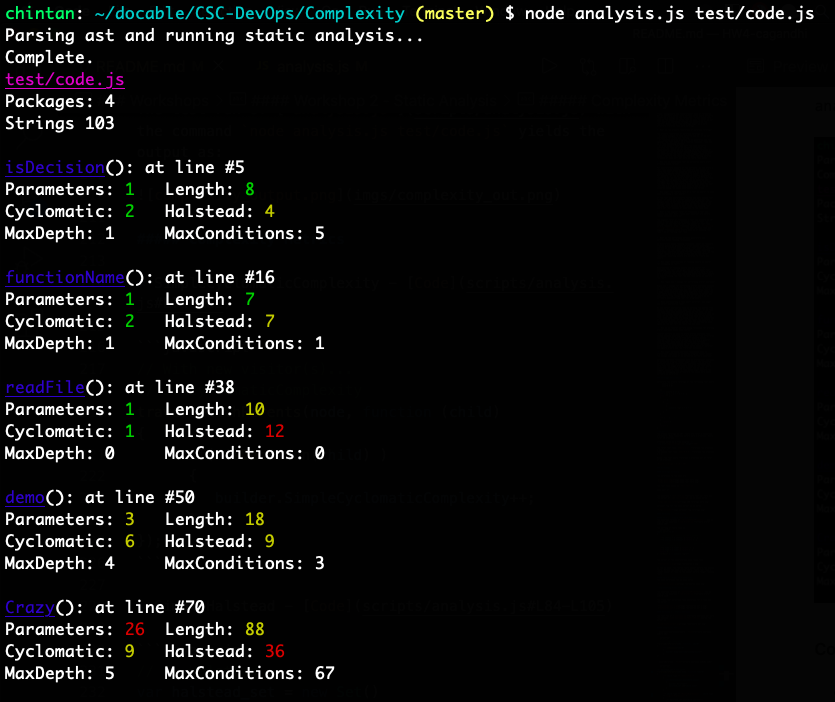

# HW4 - Testing and Analysis

**Name:** Chintan Gandhi <br>
**Unity ID:** cagandhi <br>
**Student ID:** 200315238

## Table of Contents
- [Class discussion](#class-discussion)
- [Conceptual Questions](#conceptual-questions)
- [Coverage Calculation](#coverage-calculation)
- [Workshops](#workshops)
  * [Coverage workshop](#coverage-workshop)
  * [Workshop 1 - Test Suites](#workshop-1---test-suites)
    + [Task 1 - Simple test case analysis](#task-1---simple-test-case-analysis)
    + [Task 2 - Flaky test detection](#task-2---flaky-test-detection)
  * [Workshop 2 - Static Analysis](#workshop-2---static-analysis)
    + [Complexity Metrics](#complexity-metrics)
    + [Advanced Metrics](#advanced-metrics)


### Class discussion

Describe your discussion for testing.

1. What are some tradeoffs in having lots of unit tests and/or UI/integration tests in a CI pipeline?

Lots of unit tests and/or UI/integration tests:
* Drives developers' focus on correcting the tests rather than developing new code.
* Increases build time in the CI process.
* Research shows that unit tests are pretty useless most of the time.

2. What are some reasons why 100% test coverage (i.e. statement coverage), might be difficult, impossible, impractical, or even counter-productive to achieve in practice.
* Difficult because lots of statements and conditions in a complex code base. Covering all of them means thinking or enumerating all the use cases or branches of code and writing tests for each of them which is a tedious and time-consuming process.
* Impossible because certain code breaks only at certain times. For example, if there is some code which breaks only when a lot of iterations have been done in the loop or some external API breaks. It might be impossible to test such behaviour and in such cases, 100% test coverage might be impossible.
* Impractical because you can write a test suite which covers 100% of the code without asserting or testing anything.
* Counter-productive in practice since you waste time writing irrelevant tests. As discussed in the lecture, too many and irrelevant tests slow everyone down.

### Conceptual Questions

1. What are the two different senses of testing and how do they differ?

The two senses of testing are:
* Discovery: Executing program with the intent to find errors and see how much of the program we have covered. For example, white box testing, edge case detection, etc.
* Verify: Evaluating an attribute or capability and verifying that it meets the requirements. For example, unit testing assertions, acceptance testing, etc.

The two differ in the sense that while discovery relates to finding how much of the code you have covered, what test cases or code branches are undiscovered, verify sense of testing pertains to whether the code written actually performs the required functions and meets the requirements.

2. What is the goal of code coverage?

The goal of code coverage is to objectively measure the working of actual code and the quality of the test suite. By increasing the amount of code covered by the tests, we are decreasing the chances of having a fault.

3. Does condition coverage imply branch coverage? Why not?

No, condition coverage does not imply branch coverage. Suppose we have a `if` statement with 2 conditions. We may have a test suite which always evaluates one of the 2 conditions to be true. This would mean that we always traverse the branch where the `if` condition is true. In this case, we never traversed the `else` branch of code (where conditions evaluate to `False`) which implies that even though we had a 100% condition coverage, we didn't have 100% branch coverage. 

4. Why might be data-flow coverage be a more effective criteria for testing than achieving path coverage?

While path coverage is an interesting thing to reason about, achieving 100% path coverage in real life might be infeasible. The simplest case is where we have a while loop and we are checking for certain condition to be true. We might potentially have infinite amount of code runs. This is not practical. Data flow coverage gets out of this control flow realm and looks only at how data flows, assignments and computational uses of variables. Out of multiple paths, only certain paths would actually result in a change in the variables' values which cuts down on the number of paths that we need to cover in our test suite as explained through the example in the lecture. Hence, data flow coverage might be a more effective criteria than path coverage.

5. What is the primary limitation of mutation coverage?

The primary limitation of mutation coverage is:
* It makes changes to code directly and so, it is not applicable for black box testing. 
* It requires mutated programs to be generated and run against the test suite. In a complex codebase, this can be a time-consuming process.
* It also doesn't test how well the code actually performs the task or if it actually satisfies the requirements. Since we are testing mutated versions of our code, if the developer misunderstood the requirement and constructed the tests and the original code itself doesn't perform the required function, testing mutated versions of code will not help us learn this issue.

6. How can an acceptance test be automated while still allowing human review?

Acceptance tests can be automated by employing a pixel based comparison approach in case we have baseline screenshots for the same browser and device types. We can also automate the comparison of desired and actual states by employing a semantic UI based difference technique where we can compare the screenshots from various browsers. The human review can be included in the step where we can capture a short video of the app functioning or gameplay and then in the human review step, the tester can see whether the app is functioning as it is supposed to. In this way, acceptance tests can be automated while still allowing human review.

7. Why might the failure rate of a test be useful to know when analyzing a test suite?

If the test has historically failed and have showed real false, it would be a better indicator of whether the changes made to our code actually pass the test. We can prioritise the tests to be run based on their failure rates.

8. What's the highest level of flakyness a test can achieve and why? Hint: Think what behavior are purely random decision would be?

The highest level of flakyness a test can achieve is 50%. Since a test has only 2 outcomes - pass or fail, on average, it can fail for half the number of test runs purely randomly. Also, flakyness formula is `min(passing, failing)/(passing+failing)`. The most extreme case and highest flakyness score occurs when no of passing test runs = no of failing test runs.

9. What is the difference between generative and mutation-based fuzzing techniques?

In Generative based fuzzing technique, input is randomly created guided by grammars or other domain knowledge whereas in mutation based fuzzing, test input is randomly mutated.  The test input can be input files, existing templates, captured network traffic replayed, etc. In the former, inputs are created afresh and in the latter technique, existing inputs are mutated to create new inputs.

10. Why might minification of fuzzing inputs be useful for debugging an fault?

Minification of fuzzing inputs can be useful for debugging the fault as we get the smallest input that still produces the error. This means we are able to work with a smaller test case and debug where the fault occurs by understanding the test run and this helps us isolate the fault.

11. Why regex isn't enough for performing static analysis?

Regex isn't enough for performing static analysis because we would have to add a lot of regex in order to capture all the desired properties and that would also result in a high false positive and false negative rate. Since the tool would miss the things it is supposed to detect and incorrectly flag things which are ok, it would be an extremely disconcerting tool for programmers.

12. When implementing a code smell detector, how might you detect duplicated code?

We can detect duplicated code by parsing the syntax tree beneath the node for each node that we visit. If we find the same type node somewhere below in the code, we can keep traversing downwards using both the pointers node by node. If we find that as we traverse down in the syntax tree, same node types are being used, it is an indication of duplicated code. If not, we can reset the pointers to the initial position and search for the duplicated node again in the AST till we reach the end node.

13. Why is an visitor pattern using technique for writing static analysis based code checks?

Visitor pattern is used to write static analysis code checks because handling all the different tree structures and tokens in the syntax tree will quickly become complex. Visitor Pattern allows us to write a general code to visit each node in the tree and callback different functions passed in for different purposes which helps us selectively visit/parse nodes of interest and ignore others and the traversal mechanism.

14. How might advanced analysis techniques such as statistical analysis or automated program repair impact the design and usage of an automated software pipeline?

Advanced analysis techniques such as statistical analysis or automated program repair might impact the automated software pipeline. Statistical analysis techqniue can help find the buggy statements based on the test suite execution. Automated program repair can be used to suggest possible fixes to code which might improve the speed in debugging and ultimately the speed with which software is delivered.

### Coverage Calculation

Calculate the branch coverage of the following test suite:
   - demo(1,1,1);
   - demo(0,0,0);

```js
function demo(a,b,c) {
   if( c && b ) { c = b * b; }
   else if( a )
   {
      if( b )
      {
         if( c )
         {
            console.log( a + b + c );
         }
      }
   }

   if( a || b || c )
   {
      return 0;
   }
   return 1;
}
```
**Answer:**
The branch coverage is 50%. There are total 5 condition statements. Each condition splits into 2 branches. Hence, total 10 branches. 

Attached below is a flow diagram:<br>


The first test case `demo(1,1,1)` traverses the branches 1 and 2. <br>
The second test case `demo(0,0,0)` traverses the branches 3,4,5.

Hence, the test suite traverses 5 branches out of total of 10 branches.

`Branch coverage = 5/10 = 50%`

### Workshops

#### Coverage workshop

The solutions to the quiz are:


The test case added in `test/test.js`:
```
main.inc(-1);
```

The modified [`test/test.js`](scripts/test.js) file and the output of `npm run coverage` is as shown below:


Istanbul log for the same output is as below:


#### Workshop 1 - Test Suites

##### Task 1 - Simple test case analysis
The modified version of `calculateTestPriority()` can be seen in the modified [`lib/driver.js`](scripts/driver.js#L32-L68).

The sorting of tests code is:
```javascript
tests.sort( (a,b) =>
{
   // failed comes before passed alphabetically
   if(a.status < b.status) { return -1; }
   if(a.status > b.status) { return 1; }

   // if status for both a and b is same, compare on times; ascending order
   if(a.time < b.time) { return -1; }
   if(a.time > b.time) { return 1; }
   return 0;
}).forEach( e => console.log(e));
```

The output of the modification made looks like:


As can be seen, the failed tests appear before the passed tests. Within the same status tests, tests that took a lesser amount of time to run appear before longer running tests.

##### Task 2 - Flaky test detection
The quiz solutions can be seen below:


**Implementing Flaky Tests Analysis:**

The modified version of `calculateFlakyTests()` can be seen in the modified [`lib/driver.js`](scripts/driver.js#L70-L125).

The flaky test detection code execution for 5 runs has the output:


#### Workshop 2 - Static Analysis

The test run of [`analysis.js`](scripts/analysis.js) with the command `node analysis.js test/code.js` yields the output as:



##### Complexity Metrics

* SimpleCyclomaticComplexity - [Code](scripts/analysis.js#L74-L82)

```javascript
// With new visitor(s)...
// 5. CyclomaticComplexity
traverseWithParents(node, function (child)
{
      if( isDecision(child) )
      {
         builder.SimpleCyclomaticComplexity++;
      }
});
```

* SimpleHalstead - [Code](scripts/analysis.js#L84-L105)

```javascript
// 6. Halstead
var halstead_set = new Set()
traverseWithParents(node.body, function (child)
{
      if( child.type == "Identifier")
      {
         if(!halstead_set.has(child.name))
         {
            builder.Halstead++;
            halstead_set.add(child.name);
         }
      }

      if( child.type == "BinaryExpression" || child.type == "LogicalExpression" )
      {
         if(!halstead_set.has(child.operator))
         {
            builder.Halstead++;
            halstead_set.add(child.operator);
         }
      }
});
```

##### Advanced Metrics

* MaxConditions - [Code](scripts/analysis.js#L107-L128)

```javascript
// 7. max conditions
traverseWithParents(node, function (child)
{
      if( child.type == "IfStatement" )
      {
         let maxCond = 0;
         traverseWithParents(child, function (child1)
         {
            if( child1.type == "LogicalExpression" )
            {
                  maxCond++;
            }
         });
         maxCond++;

         if( maxCond > builder.MaxConditions )
         {
            builder.MaxConditions = maxCond;
         }
      }

});
```

* MaxNestingDepth - [Code](scripts/analysis.js#L130-L150)

```javascript
// 8. max nesting depth
var maxDepth = 0;
traverseWithParents(node, function (child)
{
      if ( childrenLength(child) == 0 )
      {
         let depth=0;
         let n=child;
         while( n.type != "FunctionDeclaration" )
         {
            if( isDecision(n) )
            {
                  depth++;
            }
            n = n.parent;
         }

         maxDepth = Math.max(depth, maxDepth);
      }
});
builder.MaxNestingDepth = maxDepth;
```
