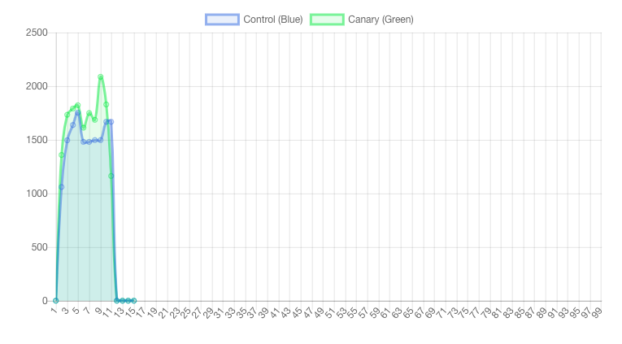
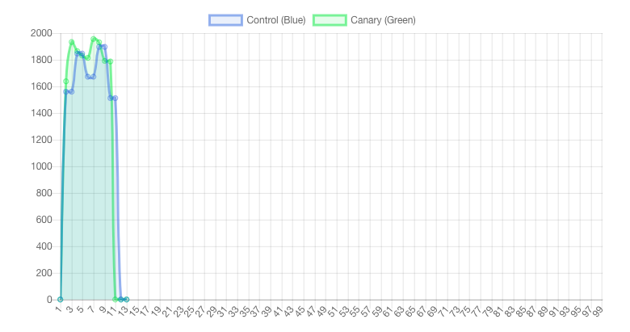
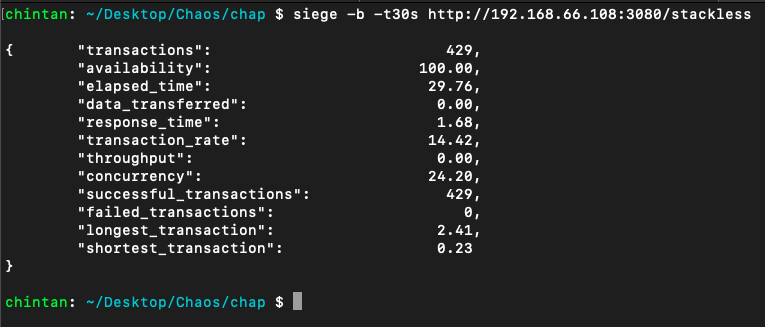
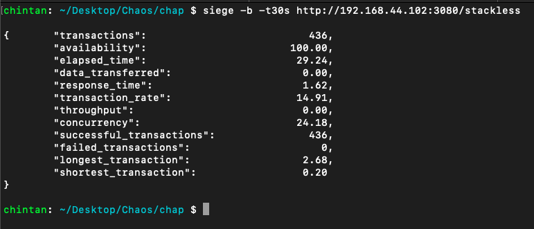

# Chaos Workshop

**Name:** Chintan Gandhi  
**Unity ID:** cagandhi  
**Student ID:** 200315238

## Table of Contents
- [Experimentation](#experimentation)
  * [Burning up the CPU of a single docker container](#burning-up-the-cpu-of-a-single-docker-container)
  * [Network traffic](#network-traffic)
  * [Killing and starting containers](#killing-and-starting-containers)
  * [Squeeze Testing](#squeeze-testing)
  * [Filling Disks](#filling-disks)
- [Reflection](#reflection)

## Experimentation

### Burning up the CPU of a single docker container

**Latency graph:**   

Latency for green canary server increases since we are running other processes on it.   

**CPU load graph:**  

Cpu load is higher on green canary as more processes are running on it.   

**Siege output green:**  

**Siege output blue:**  

No of transactions for green are lesser than those for blue since green has extra load.   

### Network traffic

**Latency graph:**

Latency for green canary server increases by a lot since corrupting 50% of network's traffic means incoming and outgoing packets to measure latency might be corrupted which would result in a higher value of latency.   

### Killing and starting containers

**Latency graph:**  

Latency for blue server increases. This is in contrast since ideally latency should increase on green since we are stopping containers on green so all requests will go to only 1 container on green versus 3 containers on blue.   

**CPU load graph:**  

It seems on average green has higher CPU load on blue but there is not much difference in CPU loads since cpu load on 1 container on 1 machine compared to CPU load on 3 containers on 1 machine does not differ by a lot.

**Siege output green:**  

**Siege output blue:**  

Siege output shows that availability for green drops drastically since only 1 container is unable to handle all the requests compared to 100% availability on the blue server. Also, we can see that green has failed transactions whereas there are no failed transactions on blue canary server.  

### Squeeze Testing

**Latency graph:**  

Latency for green server increases compared to blue since CPU capacity is lesser on green which might put more strain on the CPU in green server and also cause the latency to increase since overloaded CPU is constantly handling requests.   

**CPU load graph:**  

It seems on average green has higher CPU load on blue since it is handling almost identical amount of requests with a smaller CPU capacity.   

**Siege output green:**  

**Siege output blue:**  

No of transactions for green are almost similar to that of blue with green having 0.5 of the CPU load. This might explain a higher CPU load and increase in latency for green server.   

### Filling Disks

**Running fill_disk.sh in app3 container:**  

In this image, we see that when we run the `fill_disk.sh` on `app3`, we get the message that records are generated and `no space left on device`.

Now, after this, if I exit from the `app3` docker shell and try to enter the `app2` docker shell, I get the error message `failed to create runc console socket`. When I stop `app3` container, I am able to access the `app2` docker shell.   

**Running fill_disk.sh alongside accessing shell of another container**  

Here, I start the `app3` container again and again run the `fill_disk.sh` script to fill the space on device. However, this time I am already into the shell of `app2` container.   

Now, in the `app2` container, I can create empty files but just as I try to create a file with some content in it, we can see on the last line that for the command execution of `echo "hello world program code" > temptemp`, I get the `write error message`.   

The surprising fact that emerges from this experiment is that docker containers share memory as when I filled the disk space for `app3` container, I wasn't able to create a new file in `app2` container.

## Reflection

We can extend the workshop to collect measures such as memory load, HTTP status codes, average load etc. These measures might give us an insight on how the machines are reacting to the load. We can then conduct statistical tests between control and canary server and if the statistical difference is significant and hugely different between these control and canary servers, we can say that this event/failure would cause problems. More the statistical difference between the servers, more severe might be the problems caused by the event/failures.
